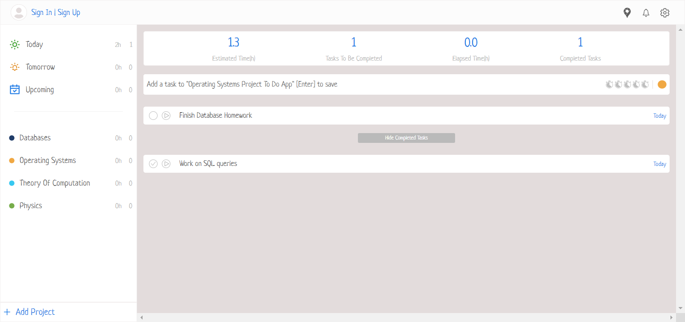
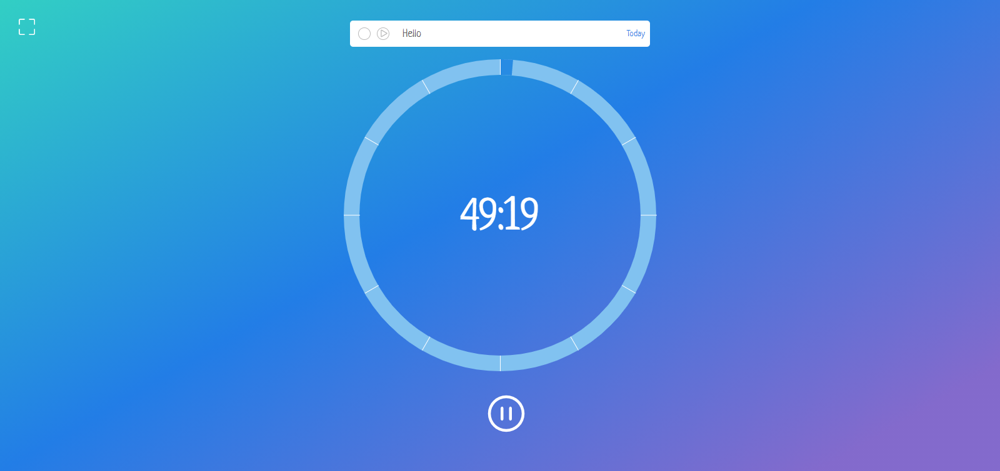
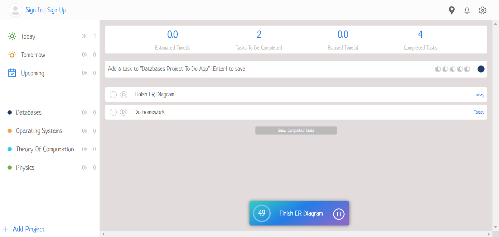
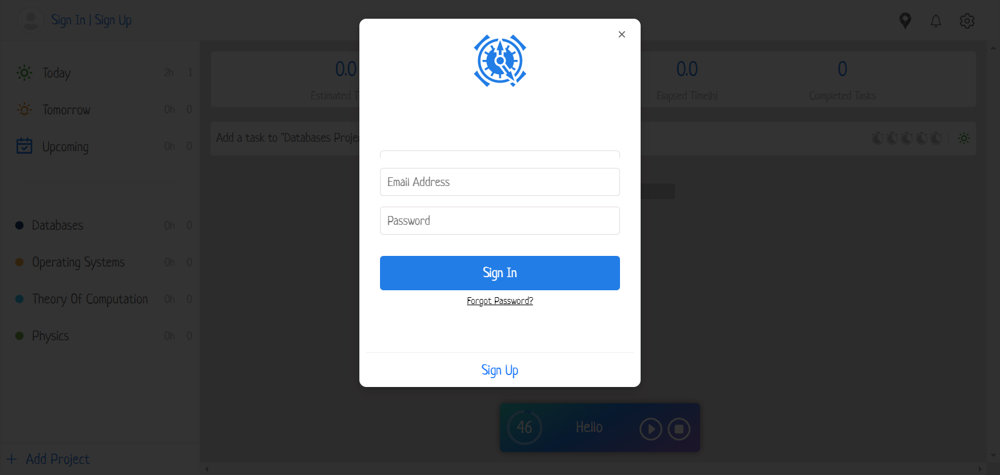
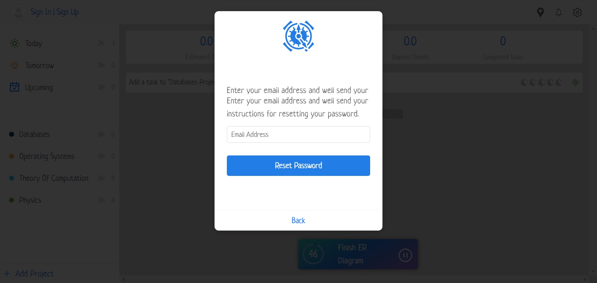

# Todo Web App 

A todo website built with react and redux to help you track your daily tasks using the pomodoro technique.

## How To Run

- Clone the repository
- Install dependencies
- Run the project

```
git clone https://github.com/Artemis-12/Todo-Webapp/tree/master
npm install
yarn start
```

## What's included

- Redux State
- React-Spring effects
- React Components
- Timer
- Styled Components

### Folder Structure

```bash
├── package-lock.json
├── package.json
├── public
│   ├── favicon.ico
│   ├── index.html
│   ├── logo192.png
│   ├── logo512.png
│   ├── manifest.json
│   └── robots.txt
├── src
│   ├── ActionTypes.js
│   ├── App.css
│   ├── App.js
│   ├── ConfigureStore.js
│   ├── components
│   │   ├── Main
│   │   ├── Modals
│   │   ├── Navbar
│   │   ├── Sidebar
│   │   └── Timer
│   ├── features
│   │   ├── projects
│   │   ├── sessions
│   │   └── todos
│   ├── index.css
│   ├── index.js
│   └── pages
│       └── Home.js
└── yarn.lock
```

## Tasks
- [X] Add to do items
  - [ ] Add sidebar that appears when items is clicked
- [ ] Add map functionality for user to specify places where he wants to study
- [X] Add react-spring effect
- [X] Add timer using react-compound-timer package
- [X] Make todos appear based on chosen menu
- [X] Add statsbar functionality
- [X] Add timer
- [ ] Add sorting of todos based on priority,duedate or randomly

## Demo





